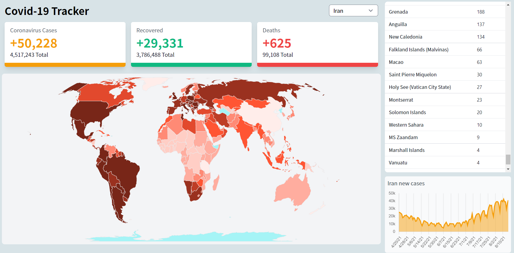

# Covid 19 Tracker

Covid 19 tracker is a web application that uses [disease.sh](https://disease.sh/docs/) API to visualize the latest Coronavirus data, such as Coronavirus new cases, number of recovered, and deaths.
#### Try [demo](https://covid19tracker-man.vercel.app/).

